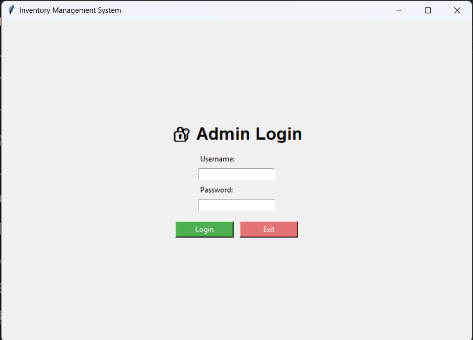
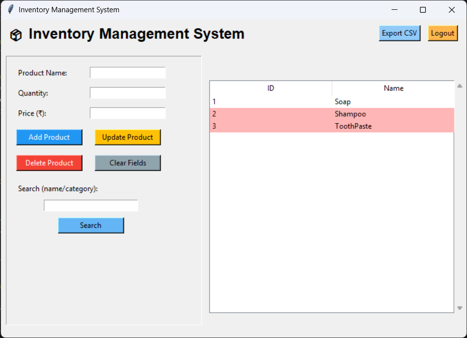
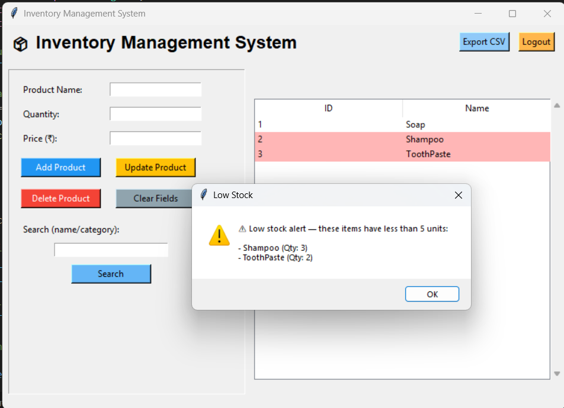

# Inventory Management System

A desktop-based Inventory Management System developed using **Python**, **Tkinter**, and **SQLite**. The application enables administrators to manage inventory efficiently through a graphical user interface with database support.

## Features

- 🔐 Secure admin login
- 📦 Add, update, delete, and search products
- 🗄️ SQLite database integration
- ⚠️ Automatic low-stock alerts
- 📤 Export inventory records to CSV
- 📋 Interactive product table
- ✅ Input validation for reliable data entry

## Use Cases

- Inventory management for small businesses
- Learning Python GUI development
- Understanding CRUD operations with SQLite
- Desktop application development

## Screenshots

### Login Screen

### Dashboard

### Low Stock Alert

## Technologies Used

- Python
- Tkinter
- SQLite3
- CSV
- Object-Oriented Programming (OOP)
